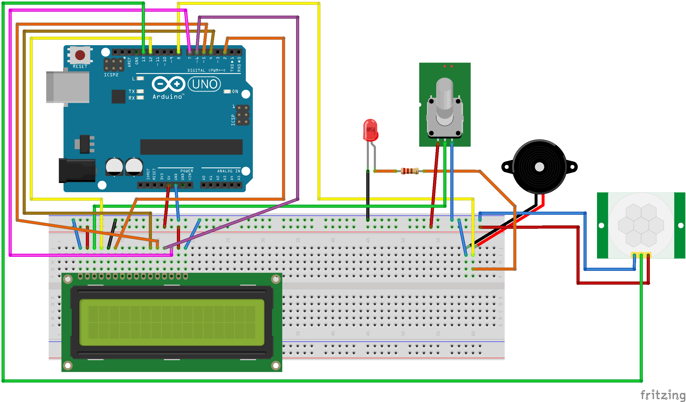

# Chinchilla Alert

Chinchilla Alert is an Arduino-based security system designed to detect motion and trigger an alarm. It uses one or more motion sensors to detect movement, and upon detection, it activates a sound alarm and displays an alert message on an LCD screen with the location of the triggered sensor.

## Features

- **Motion Detection:** Utilizes HC-SR501 motion sensors to detect movement.
- **Audible Alarm:** Activates a buzzer to provide an audible alert.
- **Visual Alert:** Displays the alert status and location of motion on an LCD screen.
- **Multi-sensor Support:** The system is designed to support multiple motion sensors.

## Hardware

- Arduino Uno (or compatible board)
- HC-SR501 PIR Motion Sensor(s)
- 16x2 LCD Display
- Buzzer
- Breadboard and jumper wires

## Software

The project is written in C++ for the Arduino platform and is structured into several classes:

- **`Chinchilla Alert.ino`**: The main sketch that initializes and runs the application.
- **`MotionDetector`**: Represents a single motion sensor, responsible for detecting movement.
- **`SoundAlarm`**: Manages the sound alarm (buzzer).
- **`LcdDisplay`**: Controls the LCD screen for displaying messages.
- **`CompositeMotionDetector`**: The core component that orchestrates the system, monitoring the sensors and triggering alarms and display changes.

## Circuit Design

Check out [tweet](https://twitter.com/tiksn/status/973694012753248258) of the prototype.
